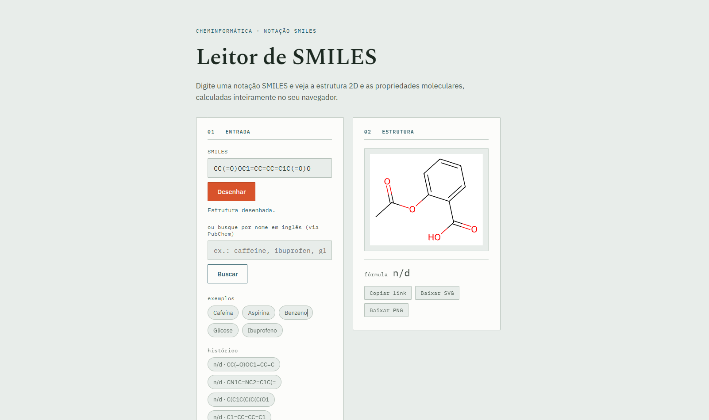

# Leitor de SMILES



Visualizador de estruturas moleculares: converte uma notação SMILES em uma estrutura 2D e calcula propriedades básicas (massa molar, fórmula, anéis, TPSA, entre outras). Todo o processamento acontece no navegador, via [RDKit.js](https://www.rdkit.org/) (WebAssembly) — não há backend próprio nem envio de dados a um servidor.

**Funcionalidades**
- Desenho de estrutura 2D e cálculo de propriedades a partir do SMILES.
- Busca por nome comum (ex.: "ibuprofeno"), resolvida via [API pública do PubChem](https://pubchem.ncbi.nlm.nih.gov/docs/pug-rest).
- Link compartilhável — a URL reflete a molécula atual (`?smiles=...`).
- Exportação da estrutura como SVG ou PNG.
- Histórico das últimas moléculas consultadas, salvo em `localStorage` do navegador.

## Estrutura do projeto

```
index.html       estrutura da página
style.css        identidade visual
js/app.js        ponto de entrada — estado da aplicação e eventos da interface
js/dom.js        referências de elementos e atualizações de tela
js/molecule.js   interação com o RDKit.js (parsing e propriedades)
js/pubchem.js    busca de compostos por nome via API do PubChem
js/history.js    histórico de moléculas consultadas (localStorage)
js/export.js     link compartilhável, cópia para área de transferência e exportação SVG/PNG
js/utils.js      formatação (fórmula, arredondamento, seleção de descritores)
```

`js/app.js` é carregado como módulo ES nativo (`<script type="module">`), então a divisão em arquivos não exige nenhuma etapa de build — o navegador resolve os `import`/`export` diretamente.

## Executar localmente

Como o projeto não usa build (sem npm, sem bundler), basta servir a pasta com qualquer servidor estático — abrir o `index.html` direto do disco (`file://`) pode bloquear o carregamento do WebAssembly em alguns navegadores.

```
python -m http.server 8000
# depois acesse http://localhost:8000
```


Distribuído sob a licença MIT — veja o arquivo [LICENSE](LICENSE).
